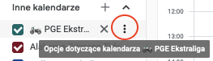
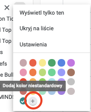
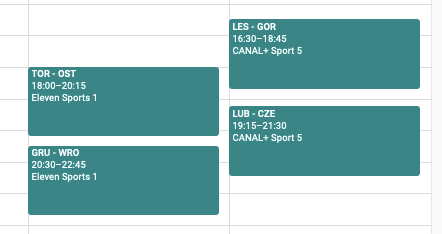
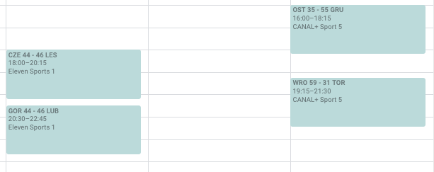

# pge_ekstraliga_terminarz
#### ⬇ English below ⬇
Tworzy plik .ics z wydarzeniami żużla w ekstralidze.  
Aktualizowany codziennie o północy.

Całość odbywa się w AWS z użyciem:
- Lambda functions - tu pracuje kod
- S3 bucket - hosting pliku z kalendarzem
- EventBridge - reguła na codzienne wywoływanie funkcji

Dla zainteresowanych link do kalendarza:  
`https://speedway-calendar.s3.eu-central-1.amazonaws.com/pge_ekstraliga.ics`  
Link można skopiować i dodać terminarz do kalendarza Google przez `Dodaj inne kalendarze -> Z adresu URL`.  
W nazwie kalendarza można używać emotikon, np. 🏍 PGE Ekstraliga  
Google pozwala też ustawić niestandardowy kolor wyświetlanych wydarzeń dla subskrybowanych kalendarzy.  
Kod szesnastkowy koloru **PGE Ekstraligi** to `#018787` 

|  |  |
| ------------------------------------------ | ------------------------------------------ |

Po rozegranym meczu w tytule pojawia się także jego wynik po kolejnej aktualizacji.

### **Uwaga!**  
Niektóre przyszłe wydarzenia nie mają informacji o konkretnym kanale telewizyjnym lub/i są w kalendarzu ustawione na godzinę 00:00.  
Nie jest to błąd programu, a brak informacji w PGE (nie widać ich także w aplikacji ani na stronie PGE Ekstraligi).  
Wraz z postępowaniem sezonu, informacje te są uzupełniane.

---

This program is used to create .ics file with Polish Speedway Extraleague timetable.  
It is updated daily on midnight.

The whole process is running on AWS:
- Lambda functions - where the code is running
- S3 bucket - file hosting
- EventBridge - it makes sure to trigger the code daily

If you are interested in subscribing to the calendar, use this link:  
`https://speedway-calendar.s3.eu-central-1.amazonaws.com/pge_ekstraliga.ics`  
The link might be copied and added to Google Calendar using `Add other calendar -> From URL`.  
You can use emotes in calendar's name, e.g. 🏍 PGE Ekstraliga  
Google also lets you use nonstandard colors for subscribed calendars events.  
Hexadecimal code for **PGE Ekstraliga** (Polish Speedway Extraleague) is `#018787` 

|  |  |
| ------------------------------------------ | ------------------------------------------ |

After the match is over, the score is added to the name with the next update.

### **Caution!**
Some future events might not have information about the TV channel or the hour the match is starting, thus they are set at 00:00.  
It is not the issue with this script, but the lack of information on PGE side (they are missing on the official app and website as well).  
As the season progress, the information is added.
